[![GitHub Release][releases-shield]][releases]
[![GitHub Activity][commits-shield]][commits]
[![License][license-shield]](LICENSE)
[![hacs][hacs_badge]][hacs]
[![BuyMeCoffee][buymecoffeebadge]][buymecoffee]


>  This integration allows you to optimize the use of your solar energy. It controls the switching on and off of your equipment, the activation of which is deferred over time depending on production and current electricity consumption.

- [What is Solar Optimizer?](#what-is-solar-optimizer)
- [How does it work?](#how-does-it-work)
  - [Anti-flickering](#anti-flickering)
  - [Usability](#usability)
  - [Device Prioritization](#device-prioritization)
  - [Setting Purchase and Resale Costs](#setting-purchase-and-resale-costs)
- [Installation](#installation)
  - [Migration Procedure from Version 2.x to 3.x](#migration-procedure-from-version-2x-to-3x)
  - [HACS installation (recommended)](#hacs-installation-recommended)
  - [Manual Install](#manual-install)
- [The configuration](#the-configuration)
  - [Configure the Integration for the First Time](#configure-the-integration-for-the-first-time)
  - [Configure the Devices](#configure-the-devices)
    - [Configuring a Simple Device (On/Off)](#configuring-a-simple-device-onoff)
  - [Configuring a Device with Variable Power](#configuring-a-device-with-variable-power)
  - [Algorithm Selection](#algorithm-selection)
  - [Configuration Examples](#configuration-examples)
    - [Controlling Tesla Charging](#controlling-tesla-charging)
    - [Controlling an Air Conditioner hvac mode](#controlling-an-air-conditioner-hvac-mode)
    - [Controlling an Air Conditioner preset](#controlling-an-air-conditioner-preset)
    - [Controlling a Dehumidifier](#controlling-a-dehumidifier)
    - [Control for a Light](#control-for-a-light)
    - [Control for a dimmable Light](#control-for-a-dimmable-light)
  - [Configuring the Algorithm in Advanced Mode](#configuring-the-algorithm-in-advanced-mode)
    - [Enabling Advanced Configuration](#enabling-advanced-configuration)
- [Available Entities](#available-entities)
  - [The "configuration" Device](#the-configuration-device)
  - [Devices and Their Entities](#devices-and-their-entities)
    - [Switch Attributes](#switch-attributes)
- [Priority Management](#priority-management)
  - [Priority Weight](#priority-weight)
  - [Device Priority](#device-priority)
- [Events](#events)
- [Actions](#actions)
  - [reset\_on\_time](#reset_on_time)
- [Creating Sensor Templates for Your Installation](#creating-sensor-templates-for-your-installation)
  - [start\_device](#start_device)
  - [stop\_device](#stop_device)
- [Creating Sensor Templates for Your Installation](#creating-sensor-templates-for-your-installation-1)
    - [File `configuration.yaml`:](#file-configurationyaml)
    - [File `templates.yaml`:](#file-templatesyaml)
- [Official Lovelace Card](#official-lovelace-card)
  - [Global Information](#global-information)
  - [Per-Device Information](#per-device-information)
  - [Device Status](#device-status)
  - [Secondary Info](#secondary-info)
  - [Activation History Bar](#activation-history-bar)
  - [Available Actions](#available-actions)
  - [How to Use the Official Card](#how-to-use-the-official-card)
- [Contributions are welcome!](#contributions-are-welcome)


> _*News*_
> * **release 3.8.1**:
>   - **Timed forced activation**: new duration selector (1h, 4h, 12h, 24h) next to the START button. When a duration is selected, the device is switched on in MANUAL mode for the chosen duration, then automatically turns off and returns control to SO. The timer is persisted across HA restarts. See [start\_device](#start_device) and [stop\_device](#stop_device)
> * **release 3.8.0**:
>   - **Device status clarification**: new `MANUAL` status (amber) when a device is physically active but SO management is disabled. The left border now always reflects the physical state (green = on, grey = off), independently of the SO control state. See [Device Status](#device-status)
>   - **Secondary info**: new `secondary_info` option to display custom per-device information using templates. See [Secondary Info](#secondary-info)
>   - **Collapsed by default**: all device blocks are collapsed on first load. The open/close state of each block is persisted in the browser `localStorage`.
> * **release 3.7.0**:
>   - added an official native Lovelace card (`custom:solar-optimizer-card`) bundled with the integration. See [Official Lovelace Card](#official-lovelace-card)
> * **release 3.5.0**:
>   - added support for priority management. See [Priority Management](#priority-management)
> * **release 3.2.0** :
> - Added an optional sensor for the net instantaneous power charged or discharged in the battery. This value is added to the net consumed power. Since the battery charging power affects the power available for the devices, it is taken into account. The sensor must report a value in watts, positive when the battery is discharging and negative when the battery is charging.
> * **release 3.0.0** :
> - Added a configuration UI for devices.
> - ⚠️ Installing release 3.0.0 requires a specific procedure. See the migration procedure below [here](#migration-procedure-from-version-2x-to-3x).

# What is Solar Optimizer?
This integration will allow you to maximize the use of your solar production. You delegate to it the control of your equipment whose activation can be deferred over time (water heater, swimming pool pump, electric vehicle charge, dishwasher, washing machine, etc.) and it takes care of launching them when the power produced is sufficient.

It constantly tries to minimize the import and export of energy by starting, stopping and modifying the power allocated to equipment.

2 types of equipment are managed:
1. equipment controlled by a switch (a service in general) which has a fixed and pre-determined power consumption,
2. equipment whose power consumption is adjustable (Tesla, Robotdyn). By adjusting the power allocated to this equipment, Solar Optimizer aligns consumption as closely as possible with production.

The ideal is to have at least one piece of equipment whose power is adjustable in the list of equipment managed by Solar Optimizer.

# How does it work?
The operation is as follows:
1. at regular intervals (configurable), the algorithm simulates modifications to the states of the equipment (on / off / allocated power) and calculates a cost for this configuration. Overall the cost is the `a * imported_power + b * exported_power`. The coefficients a and b are calculated according to the cost of electricity at the time of calculation,
2. the algorithm keeps the best configuration (the one with a minimum cost) and looks for other solutions, until a minimum is reached.
3. the best configuration is then applied.

Two optimization algorithms are available, selectable via the `algorithm_type` configuration field:

- **Simulated Annealing** (default): a probabilistic metaheuristic that explores many random configurations and converges on a near-optimal solution. It handles variable-power devices and complex trade-offs well. A description can be found here: https://fr.wikipedia.org/wiki/Recuit_simul%C3%A9
- **Greedy Priority**: a fast deterministic two-pass algorithm that turns on the highest-priority devices first (within available solar surplus), then turns off the lowest-priority devices if there is a deficit. It also supports **load shedding** — forcing a lower-priority active device off to free power for a higher-priority waiting device (when `priority_weight > 0`). Recommended when device priority ordering matters more than fine-grained power balance.

## Anti-flickering
To avoid the effects of flickering from one cycle to another, a minimum activation delay can be configured by equipment: `duration_min`. For example: a water heater must be activated for at least one hour for the ignition to be useful, charging an electric car must last at least two hours, ...
Similarly, a minimum stop duration can be specified in the `duration_stop_min` parameter.

## Usability
Each configured device is associated with a switch-type entity named `enable` that authorizes the algorithm to use the device. If I want to force the heating of the hot water tank, I put its switch to off. The algorithm will therefore not look at it, the water heater switches back to manual, not managed by Solar Optimizer.

In addition, it is possible to define a usability rule for equipment. For example, if the car is charged at more than 90%, the algorithm considers that the equipment which controls the charging of the car must be switched off. This rule is defined in the form of a configurable template which is True if the equipment is usable.

If a battery is specified when configuring the integration and if the threshold `battery_soc_threshold` is specified, the equipment will only be usable if the soc (percentage of battery charge) is greater than or equal to the threshold.

A maximum daily usage time is optionally configurable. If it is valued and if the duration of use of the equipment is exceeded, then the equipment will not be usable by the algorithm and therefore leaves power for other equipment.

A minimum daily usage time is also optionally configurable. This parameter ensures that the equipment will be on for a certain minimum duration. You specify at what time the off-peak hours start (`offpeak_time`) and the minimum duration in minutes (`min_on_time_per_day_min`). If at the time indicated by `offpeak_time`, the minimum activation duration has not been reached, then the equipment is activated until the change of day (configurable in the integration and 05:00 by default) or until the maximum usage is reached (`max_on_time_per_day_min`) or during all the off-peak hours if `max_on_time_per_day_min` is not set. This ensures that the water heater or the car will be charged the next morning even if the solar production has not allowed the device to be recharged. It is up to you to invent the uses of this function.

These 5 rules allow the algorithm to only order what is really useful at a time t. These rules are re-evaluated at each cycle.

## Device Prioritization
Priority management is described [here](#priority-management).

## Setting Purchase and Resale Costs
The behavior of the algorithm is strongly influenced by the values of the sensors **"imported kWh cost"** and **"exported kWh cost"**.
The algorithm calculates the *"fictitious cost"* of a combination of on/off states and desired power levels for the controlled devices.

If these two values are equal, then the cost of importing 500 W from the grid will be the same as the cost of exporting 500 W to the grid.
Therefore, SO can either reject the 500 W (under-consumption) or import 500 W (over-consumption), as long as production allows.

The values of the purchase and resale cost sensors should be set as follows:

1. **If they are equal** → SO will accept import and export equally. For SO, it “costs” the same to export 500 W as to import 500 W.
2. **If purchase cost >> resale cost** → SO will minimize import but may export more (energy lost).
3. **If resale cost >> purchase cost** → the opposite happens: SO will minimize export and potentially import more (thus increasing the bill).

👉 If you want to avoid any import (i.e., buying from the grid): set the purchase cost **much higher** than the resale cost.

👉 For those with self-consumption contracts without resale: everything rejected is lost. In this case, you may want to minimize rejections, even if it means importing a bit more. For this configuration, set resale cost **much higher** than purchase cost.

On my side, I set the actual purchase costs (which vary depending on the day and time: Tempo contract) and the real resale cost of 13 cts/kWh.
So, if my purchase cost is low (off-peak blue hours), I can import more.
If the purchase cost is very high (peak red hours), I won’t import at all. That’s exactly what I want in my case — but that’s specific to me and because I have a resale contract at 13 cts/kWh.

**⚠️ WARNING:** Costs must not be zero!

# Installation

## Migration Procedure from Version 2.x to 3.x

Version 3.0.0 introduces a configuration UI that allows for easy addition and modification of controlled devices.

This procedure should only be followed if you have already installed and configured a 2.x version.

Installing v3.0.0 requires recreating all devices through the UI and removing the configuration from the `configuration.yaml` file. Follow these steps carefully:

1. Go to *Settings / Integration*, select "Solar Optimizer," and remove the "Solar Optimizer" device. The "Solar Optimizer" integration should no longer be visible.
2. Remove the configuration from your `configuration.yaml` file.
3. Open HACS, search for "Solar Optimizer," and install version 3.0.0.
4. Go to *Settings / Integration*, click on "Add Integration," and select "Solar Optimizer."
5. You will arrive at the common parameter configuration page, described [here](#configure-the-integration-for-the-first-time).

## HACS installation (recommended)

[](https://my.home-assistant.io/redirect/hacs_repository/?owner=jmcollin78&repository=solar_optimizer&category=integration)

1. Install [HACS](https://hacs.xyz/). This way you get updates automatically.
2. Add this Github repo as a custom repo in HACS settings.
3. Find and install "Solar Optimizer" in HACS and click "Install".
4. Restart Home Assistant.
5. Then you can add the Solar Optimizer integration in the integration page. You can only install one Solar Optimizer integration.

## Manual Install
Manual installation is possible. It is not recommended and therefore it will not be described here.

# The configuration

## Configure the Integration for the First Time

When adding the Solar Optimizer integration, the common parameters configuration page opens:

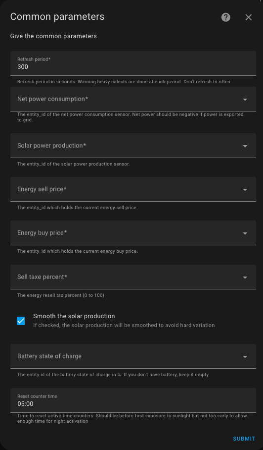

You need to specify:
1. **A refresh period** in seconds. The shorter the period, the more precise the tracking, but the higher the load on your server, as the calculations are CPU-intensive. A good average value is 5 minutes (i.e., 300 seconds).
2. The sensor that provides **the net instantaneous consumption** of the home (it should be negative if production exceeds consumption). This value is given in Watts.
3. The sensor that provides **the instantaneous photovoltaic production**, also in Watts (it is always positive or zero).
4. A sensor or `input_number` that provides **the cost of imported kWh** (required: strictly positive number).
5. A sensor or `input_number` that provides **the price of exported kWh** (required: strictly positive number). If there is no resale contract, the same value/sensor as the imported cost can be used. Do not set it to 0, as it would distort the algorithm.
6. A sensor or `input_number` that provides **the applicable tax rate on exported kWh** as a percentage (positive number or 0 if you do not resell or do not know this value). This value depends on your contract. It is not critical to the algorithm, so a value of 0 is perfectly fine.
7. An optional sensor that provides **the charge level of a possible solar battery** in percentage. If your solar installation does not include a battery, leave this field empty.
8. A sensor that provides **the net instantaneous charging power of the battery**. It must be expressed in watt and should be negative when the battery is charging and positive when the battery is discharging. This value will be added to the net consumed power. If the net consumed power is -1000 W (selling 1000 W) but the battery is charging at -500 W, it means that the surplus available for the algorithm is 1500 W.
9. **The start time of the day**. At this time, the usage counters of the equipment are reset to zero. The default value is 05:00. Ideally, this should be set before the first production of the day and as late as possible for off-peak activations.
10. **The optimization algorithm** (`algorithm_type`). Selects the algorithm used to find the optimal device configuration. Two choices: `simulated_annealing` (default) and `greedy_priority`. See [How does it work?](#how-does-it-work) for a comparison.

Except for the solar battery charge level, these parameters are essential for the algorithm to function, so they are all mandatory. Using sensors or `input_number` allows values to be updated in real-time at each cycle. Consequently, when off-peak hours begin, the calculation may change, impacting the state of the equipment as importing energy becomes cheaper. Everything is dynamic and recalculated in each cycle.

## Configure the Devices
Each controllable device must be configured by adding a new integration via the "Add a device" button available on the integration page:

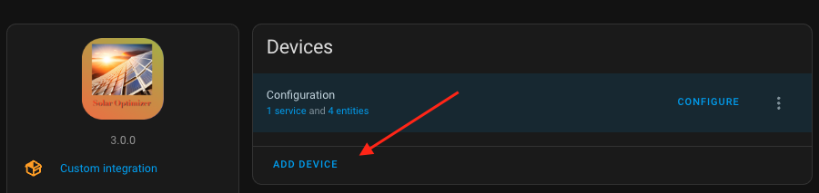

The following menu will appear, allowing you to choose between a simple on/off device or a device with variable power (to match the available power):

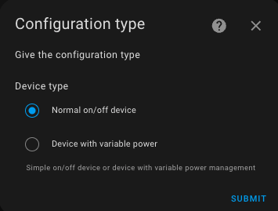

### Configuring a Simple Device (On/Off)
A simple device is controlled solely by turning it on or off (a switch). If the algorithm decides to turn it on, the device is switched on; otherwise, it is switched off. It is configured as follows:

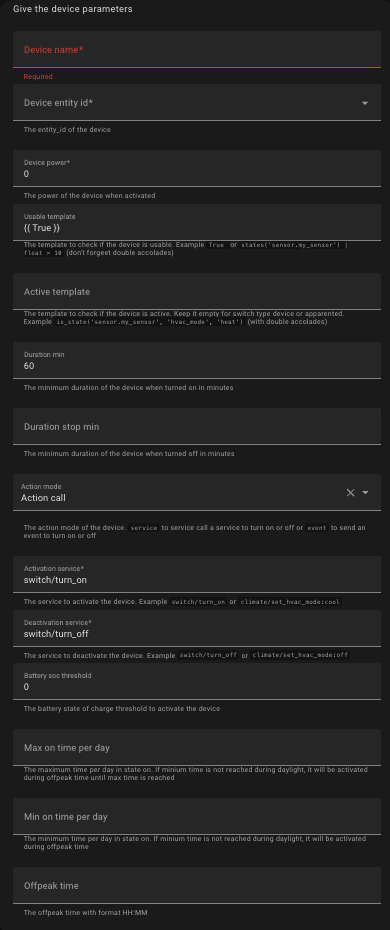

You need to specify the following attributes:

| Attribute                     | Applicable to                       | Meaning                                                                                                                                                                                                                                | Example                                          | Comment                                                                                                                                                                                                           |
| ----------------------------- | ----------------------------------- | -------------------------------------------------------------------------------------------------------------------------------------------------------------------------------------------------------------------------------------- | ------------------------------------------------ | ----------------------------------------------------------------------------------------------------------------------------------------------------------------------------------------------------------------- |
| `name`                        | All                                 | The name of the device.                                                                                                                                                                                                                | Basement Ventilation                             | The name is used to identify the entities of this device.                                                                                                                                                         |
| `entity_id`                   | All                                 | The entity ID of the device to be controlled.                                                                                                                                                                                          | switch.basement_ventilation                      | Can be a `switch`, an `humidifier`, a `climate`, a `fan`, a `select` or a `light`. If it is not a `switch`, the `activation_service` and `deactivation_service` fields must be adjusted.                          |
| `device_power` or `power_max` | All                                 | The maximum power consumption of the device when turned on, in watts.                                                                                                                                                                  | 250                                              | -                                                                                                                                                                                                                 |
| `check_usable_template`       | All                                 | A template that evaluates to `True` if the device can be used by Solar Optimizer. A template must start with `{{` and end with `}}`.                                                                                                   | {{ is_state('cover.garage_door', 'closed') }}    | In this example, Solar Optimizer will not attempt to control the "Basement Ventilation" if the garage door is open. Use `{{ True }}` if you do not need this condition.                                           |
| `active_template`             | All                                 | A template that evaluates to `True` if the device is currently active. A template must start with `{{` and end with `}}`. This template is not necessary when the state of the device is 'on' or 'off' when turned-on or off.          | {{ is_state('climate.living_room_ac', 'cool') }} | In this example, a `climate` device will be considered active by Solar Optimizer if its state is `cool`. Leave it blank for devices where the default 'on'/'off' state applies (switches and input_booleans).     |
| `duration_min`                | All                                 | The minimum activation duration in minutes.                                                                                                                                                                                            | 60                                               | The basement ventilation will always run for at least one hour when turned on.                                                                                                                                    |
| `duration_stop_min`           | All                                 | The minimum deactivation duration in minutes. Defaults to `duration_min` if not specified.                                                                                                                                             | 15                                               | The basement ventilation will always remain off for at least 15 minutes before restarting.                                                                                                                        |
| `action_mode`                 | All                                 | The action mode used to turn the device on or off. Can be either `"action_call"` or `"event"` (*).                                                                                                                                     | action_call                                      | `"action_call"` indicates that the device is controlled via an action call. See below. `"event"` means an event is triggered when the state should change. See (*) for more details.                              |
| `activation_service`          | Only if `action_mode="action_call"` | The service to call for activating the device, in the format `"domain/service[/parameter:value]"`. This template should be adapted when the device is not a switch.                                                                    | switch/turn_on                                   | Activating the device will trigger the `"switch/turn_on"` service on the `entity_id` specified.                                                                                                                   |
| `deactivation_service`        | Only if `action_mode="action_call"` | The service to call for deactivating the device, in the format `"domain/service[/parameter:value]"`.  This template should be adapted when the device is not a switch.                                                                 | switch/turn_off                                  | Deactivating the device will trigger the `"switch/turn_off"` service on the `entity_id` specified.                                                                                                                |
| `battery_soc_threshold`       | All                                 | The minimum battery charge percentage required for the device to be usable.                                                                                                                                                            | 30                                               | In this example, the device will not be used by the algorithm if the solar battery is not charged to at least 30%. Requires the battery charge state entity to be configured in the common parameters. See above. |
| `max_on_time_per_day_min`     | All                                 | The maximum number of minutes the device can be on per day. Once exceeded, the device will no longer be used by the algorithm.                                                                                                         | 10                                               | The device will be turned on for a maximum of 10 minutes per day.                                                                                                                                                 |
| `min_on_time_per_day_min`     | All                                 | The minimum number of minutes the device should be on per day. If this threshold is not reached by the start of off-peak hours, the device will be activated until the start of the day or until `max_on_time_per_day_min` is reached. | 5                                                | The device will run for at least 5 minutes per day, either during solar production or during off-peak hours.                                                                                                      |
| `offpeak_time`                | All                                 | The start time of off-peak hours in `hh:mm` format.                                                                                                                                                                                    | 22:00                                            | The device may be turned on at 22:00 if solar production during the day was insufficient.                                                                                                                         |

## Configuring a Device with Variable Power
This type of device allows for adjusting the power consumption based on solar production and the algorithm's decisions. Essentially, it acts as a software-based solar router, enabling, for example, an electric vehicle to charge using only surplus solar energy.

All the parameters described [here](#configuring-a-simple-device-onoff) apply and must be supplemented with the following:

| Attribute                     | Applicable to         | Meaning                                                      | Example                                                  | Comment                                                                                                                                                                                                                                                                                                                                   |
| ----------------------------- | --------------------- | ------------------------------------------------------------ | -------------------------------------------------------- | ----------------------------------------------------------------------------------------------------------------------------------------------------------------------------------------------------------------------------------------------------------------------------------------------------------------------------------------- |
| `power_entity_id`             | Variable power device | The `entity_id` of the entity managing power levels          | `number.tesla_charging_amps`                             | The power adjustment is done by calling the `change_power_service` on this entity. It can be either a `number`, an `input_number`, a `fan` or a `light`. If it is not a `number`, the `change_power_service` field must be adjusted.                                                                                                      |
| `power_min`                   | Variable power device | The minimum power in watts for the device                    | 100                                                      | If the power setting drops below this value, the device will be turned off via the `deactivation_service`. This parameter works with `power_max` to define the range of power adjustment.                                                                                                                                                 |
| `power_step`                  | Variable power device | The power adjustment step in watts                           | 10                                                       | For an electric vehicle, set this to 220 (220V x 1A).<br/>For `light` entity with `brightness` attribute set it to `power_max / 255`<br/>For `fan` entity with `percentage` attribute set it to `power_max / 100`                                                                                                                         |
| `change_power_service`        | Variable power device | The service to call to adjust power levels                   | `number/set_value`<br/>or<br/>`light/turn_on/brightness` | For `fan` or `light` power entities, you must provide the attribute to set power, typically `brightness` or `percentage`                                                                                                                                                                                                                  |
| `convert_power_divide_factor` | Variable power device | The divisor applied to convert power into the required value | 50                                                       | In this example, the `"number/set_value"` service is called with `power setpoint / 50` on the `entity_id`. For a Tesla in a three-phase installation, the value should be 660 (220V x 3) to convert power into amperes. For a single-phase setup, use 220.<br/>For `light` or `fan` entity set it to the same value of `power_step` field |

## Configuration Examples
The examples below should be adapted to your specific case.

### Controlling Tesla Charging
To control the charging of a Tesla vehicle with adjustable charging intensity, if the solar battery is charged to 50%, in three-phase mode with off-peak charging starting at 11:00 PM, here are the parameters:

```yaml
  name: "Recharge Tesla"
  entity_id: "switch.tesla_charger"
  power_min: 660
  power_max: 3960
  power_step: 660
  check_usable_template: "{{ is_state('input_select.charge_mode', 'Solaire') and is_state('binary_sensor.tesla_wall_connector_vehicle_connected', 'on') and is_state('binary_sensor.tesla_charger', 'on') and states('sensor.tesla_battery') | float(100) < states('number.tesla_charge_limit') | float(90) }}"
  # 2 heures
  duration_min: 120
  # 15 min stop
  duration_stop_min: 15
  # Power management
  power_entity_id: "number.tesla_charging_amps"
  # 5 min
  duration_power_min: 5
  action_mode: "service_call"
  activation_service: "switch/turn_on"
  deactivation_service: "switch/turn_off"
  change_power_service: "number/set_value"
  convert_power_divide_factor: 660
  battery_soc_threshold: 50
  min_on_time_per_day_min: 300
  offpeak_time: "23:00"
```

In single-phase mode, replace 660 with 220. You should at least adjust the maximum power and the `check_usable_template`.

### Controlling an Air Conditioner hvac mode
To turn on an air conditioner if the temperature is above 27°C:

```yaml
    name: "Climatisation salon"
    entity_id: "climate.clim_salon"
    device_power: 1500
    check_usable_template: "{{ states('sensor.temperature_salon') | float(0) > 27 }}"
    active_template: "{{ is_state('climate.vtherm', 'cool') }}"
    # 1 h minimum
    duration_min: 60
    action_mode: "service_call"
    activation_service: "climate/set_hvac_mode/hvac_mode:cool"
    deactivation_service: "climate/set_hvac_mode/hvac_mode:off"
    battery_soc_threshold: 80
```

### Controlling an Air Conditioner preset
To change the preset of an air conditioner if the temperature is above 27°C:

```yaml
    name: "Climatisation salon"
    entity_id: "climate.clim_salon"
    device_power: 1500
    check_usable_template: "{{ states('sensor.temperature_salon') | float(0) > 27 }}"
    active_template: "{{ is_state_attr('climate.clim_salon', 'preset_mode', 'boost') }}"
    # 1 h minimum
    duration_min: 60
    action_mode: "service_call"
    activation_service: "climate/set_preset_mode/preset_mode:boost"
    deactivation_service: "climate/set_preset_mode/preset_mode:eco"
    battery_soc_threshold: 80
```

### Controlling a Dehumidifier
To turn on a dehumidifier if the humidity exceeds a threshold for at least one hour per day, with the possibility of activation during off-peak hours:

```yaml
  name: "Dehumidification musique"
  entity_id: "humidifier.humidifier_musique"
  device_power: 250
  # 1 h
  duration_min: 60
  duration_stop_min: 30
  check_usable_template: "{{ states('sensor.humidite_musique') | float(50) > 55 }}"
  action_mode: "service_call"
  activation_service: "humidifier/turn_on"
  deactivation_service: "humidifier/turn_off"
  max_on_time_per_day_min: 180
  min_on_time_per_day_min: 60
  offpeak_time: "02:00"
```

### Control for a Light

To turn on a light as an indicator of available solar production:

```yaml
  name: "Lighting"
  entity_id: "light.production_indicator_lamp"
  device_power: 100
  check_usable_template: "{{ True }}"
  action_mode: "service_call"
  activation_service: "light/turn_on"
  deactivation_service: "light/turn_off"
  offpeak_time: "02:00"
```

### Control for a dimmable Light

To control light brightness

```yaml
  name: "Eclairage dimmable"
  entity_id: "light.shelly_dimmer"
  power_min: 10
  power_max: 100
  # power_max / 255
  power_step: 0.4
  check_usable_template: "{{ True }}"
  power_entity_id: "light.shelly_dimmer"
  # 5 min
  duration_power_min: 5
  action_mode: "service_call"
  activation_service: "light/turn_on/brightness:0"
  deactivation_service: "light/turn_off"
  change_power_service: "light/turn_on/brightness"
  # same value of power_step
  convert_power_divide_factor: 0.4
  offpeak_time: "02:00"
```

## Algorithm Selection

Solar Optimizer supports two optimization algorithms. Choose based on your needs:

| | Simulated Annealing (default) | Greedy Priority |
|---|---|---|
| **Strategy** | Probabilistic search over many random configurations | Deterministic two-pass: turn on high-priority first, turn off low-priority if deficit |
| **Variable power** | Full support | Not supported |
| **Load shedding** | Not supported | Supported (`priority_weight > 0`) |
| **CPU usage** | Higher (~1000 iterations per cycle) | Lower (O(n log n) per cycle) |
| **Best for** | Variable-power devices (EV charger, solar router) | Fixed-power devices where priority ordering matters |

Set `algorithm_type` in the integration configuration to `simulated_annealing` (default) or `greedy_priority`.

## Configuring the Algorithm in Advanced Mode (Simulated Annealing only)
Advanced configuration allows modifying the **Simulated Annealing** algorithm's settings. These settings have no effect when `algorithm_type: greedy_priority` is selected. It is not recommended to change these settings unless you have specific needs. The algorithm uses a **simulated annealing** approach to search for optimal configurations (combinations of on/off states) and evaluates a cost function at each iteration.

During each iteration, the algorithm randomly changes the state of some devices and evaluates the cost function. If the new evaluation is better than the previous one, it is kept. If it is worse, it may still be kept based on a "temperature" parameter. This temperature gradually decreases over iterations, allowing the algorithm to converge toward an optimal solution.

### Enabling Advanced Configuration
To use the advanced configuration, follow these steps:

1. Add the following line to your `configuration.yaml` file:

   ```yaml
   solar_optimizer: !include solar_optimizer.yaml
   ```
2.	Create a file named solar_optimizer.yaml at the same level as configuration.yaml and include the following settings:

  ``` yaml
  algorithm:
    initial_temp: 1000
    min_temp: 0.1
    cooling_factor: 0.95
    max_iteration_number: 1000
  ```

Explanation of Parameters
	•	`initial_temp`: The initial temperature. Cost function variations up to 1000 are accepted in the first iterations. If you have high-power devices, you may increase this value. For lower-power devices, it can be reduced.
	•	`min_temp`: The minimum temperature. At the final stage of the optimization, only variations of 0.1 will be accepted. This parameter should not be modified.
	•	`cooling_factor`: The temperature is multiplied by 0.95 at each iteration, ensuring a slow and progressive decrease. A lower value makes the algorithm converge faster but may reduce solution quality.	A higher value (strictly less than 1) increases computation time but improves the solution quality.
	•	`max_iteration_number`: The maximum number of iterations. Reducing this number can shorten computation time but may degrade solution quality if no stable solution is found.

The default values are suited for setups with around 20 devices (which results in many possible configurations). If you have fewer than 5 devices and no variable power devices, you can try these alternative parameters (not tested):

  ```yaml
  algorithm:
    initial_temp: 1000
    min_temp: 0.1
    cooling_factor: 0.90
    max_iteration_number: 300
  ```

# Available Entities
## The "configuration" Device
Once the integration is properly configured, a **device** named `'configuration'` is created, containing several entities:

1. A sensor named `total_power`: the total power of all devices controlled by Solar Optimizer.
2. A sensor named `best_objective`: the cost function value (see algorithm operation). The **lower** the value, the **better** the solution.
3. A sensor named `power_production`: the last **smoothed** solar production value considered (if the option is enabled).
4. A sensor named `power_production_brut`: the last **raw** solar production value considered.
5. a dropdown list named `priority weight` which defines the weight given to priority management compared to solar consumption optimization. See [priority management](#priority-management).

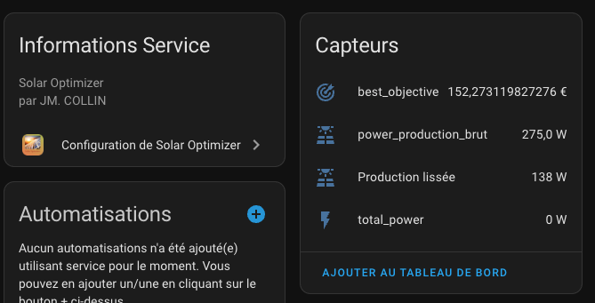

Reconfiguring this device allows modifying the **Solar Optimizer** settings.

## Devices and Their Entities
Each controlled device has the following entities:

1. A **switch** named `switch.enable_solar_optimizer_<name>`:
   - If **"Off"**, the device is ignored by the algorithm.
   - This allows manually **excluding** a device **without modifying** the configuration.
   - This switch contains **additional attributes** to monitor the device's internal state as seen by the algorithm.

2. A **sensor** named `sensor.on_time_today_solar_optimizer_<name>`:
   - Indicates the **activation duration** since the last reset (**see `raz_time`**).

3. A **switch** named `switch.solar_optimizer_<name>`:
   - Reflects the **activation state** requested by **Solar Optimizer**.

4. A dropdown list named **"Priority"** which defines the priority level of this device. Possible values range from 'Very low' to 'Very high'. See [priority management](#priority-management).

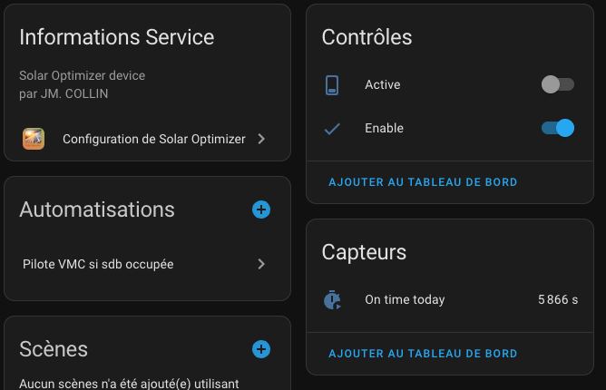

### Switch Attributes
The `switch.solar_optimizer_<name>` contains **attributes** accessible via **Developer Tools → States**:

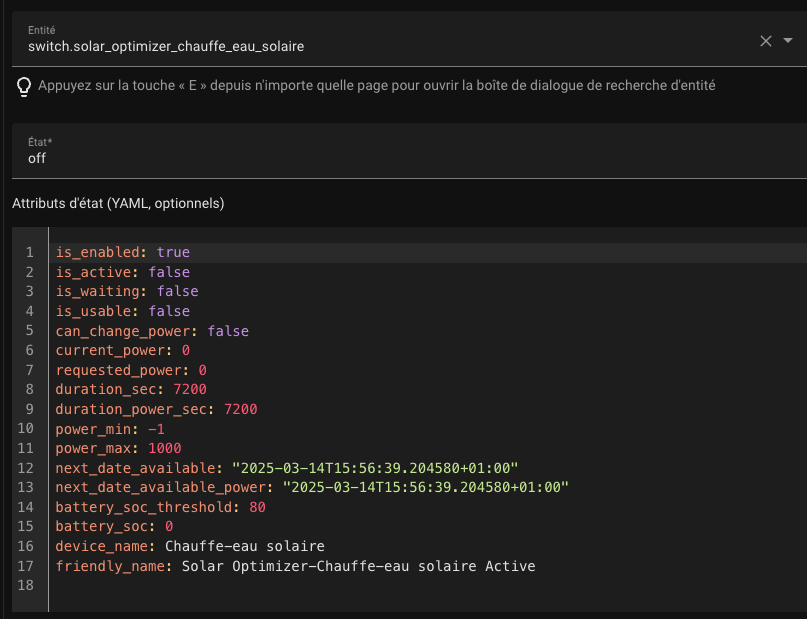

| Attribute Name              | Description                                                                                 |
| --------------------------- | ------------------------------------------------------------------------------------------- |
| `is_enabled`                | `true` if the device is enabled by the user for optimization.                               |
| `is_active`                 | `true` if the device is currently **on**.                                                   |
| `is_usable`                 | `true` if the algorithm **can** use the device.                                             |
| `can_change_power`          | `true` if the device's power **can** be adjusted.                                           |
| `current_power`             | The **current power consumption** of the device.                                            |
| `requested_power`           | The power level requested by **Solar Optimizer**.                                           |
| `duration_sec`              | The total **activation duration** in seconds.                                               |
| `duration_power_sec`        | The duration of the **last power change** in seconds.                                       |
| `next_date_available`       | The **next available time** for the device to be used by the algorithm.                     |
| `next_date_available_power` | The **next available time** for a power adjustment.                                         |
| `battery_soc_threshold`     | The **minimum** battery **state of charge (SOC)** required for the device to be considered. |
| `battery_soc`               | The **current** battery **state of charge (SOC)**.                                          |

# Priority Management

From the user’s perspective, two values must be provided:

1. **Priority weight** — this is the weight given to priority compared to solar consumption optimization. These two notions are somewhat contradictory: optimizing solar production usage can conflict with prioritizing specific devices. A prioritized device may be turned on more often, potentially reducing optimization efficiency. This setting is available in the "Configuration" device as a `select` entity.

2. **Device priority** — this defines the priority level for each individual device. It is a selectable list with five values ranging from 'Very low' to 'Very high'. The higher the priority, the more likely the device is to be activated by the algorithm. This setting is available in the device entity as a `select`.

## Priority Weight

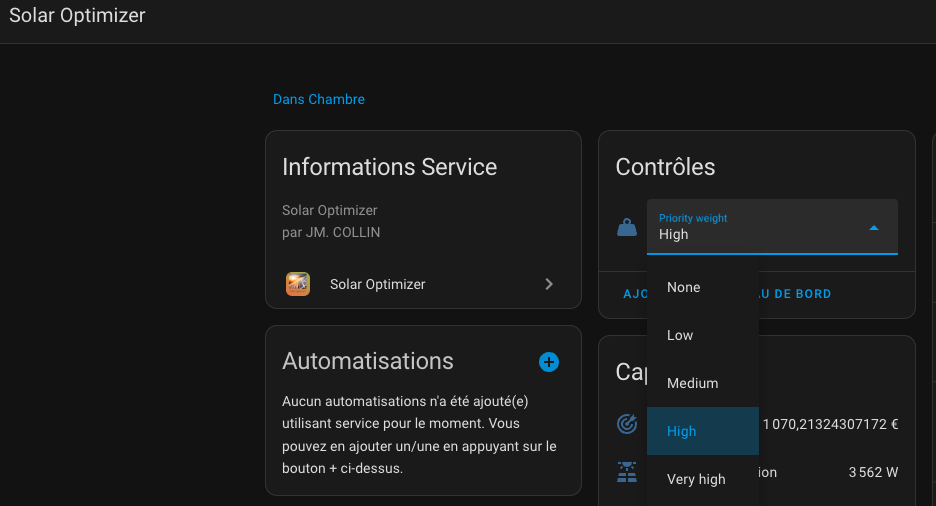

The higher this value is, the more priority is considered by the algorithm at the expense of optimization. Selecting `None` fully disables the priority mechanism and ensures maximum optimization of solar consumption.

## Device Priority

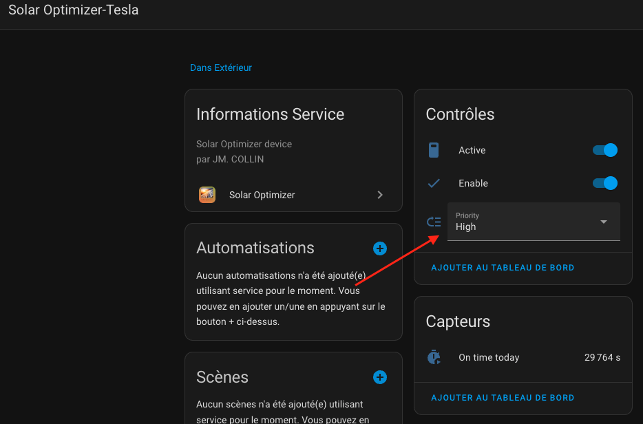

The higher the priority, the more often the device will be activated by the algorithm, potentially at the expense of lower-priority devices.

>  _*Notes*_
> 1. Prioritizing certain devices can reduce solar production consumption efficiency. It is normal to observe unused surplus if priorities are enabled. You can adjust how much priority impacts the algorithm by changing the [priority weight](#priority-weight).
> 2. Priority is not absolute — it is possible for a lower-priority device to be turned on while a higher-priority one is not. This depends on factors like device power usage, available solar power, minimum run times, etc. If this happens too often, fine-tune the priority level or the priority weight as explained above.

# Events

Solar Optimizer generates events each time a device is turned on or off. This allows you to capture these events in an automation, for example.

`solar_optimizer_state_change_event`: Triggered when a device changes state. The event message contains the following data:
```
event_type: solar_optimizer_state_change_event
data:
  action_type: [Activate | Deactivate],
  requested_power: <la nouvelle puissance demandée si disponible>,
  current_power: <la puissance demandée si disponible>,
  entity_id: <l'entity_id de l'appareil commandé>,
```

`solar_optimizer_change_power_event`: Triggered when a device changes power. The event message contains the following data:
```
event_type: solar_optimizer_state_change_event
data:
  action_type: [ChangePower],
  requested_power: <la nouvelle puissance demandée si disponible>,
  current_power: <la puissance demandée si disponible>,
  entity_id: <l'entity_id de l'appareil commandé>,
```

You can monitor the reception and content of events in Developer Tools / Events. Enter the name of the event to listen for:

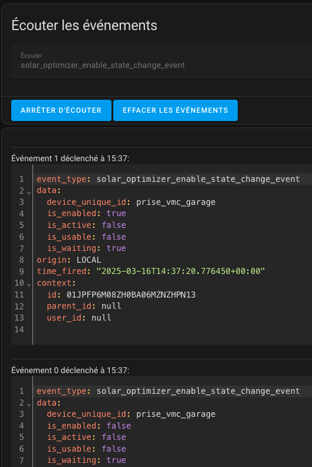

An example of an automation that listens for events:

```yaml
alias: Gestion des events de Solar Optimizer
description: Notifie les modifiations de status de Solar Optimizer
mode: parallel
max: 50
triggers:
  - event_type: solar_optimizer_change_power_event
    id: power_event
    trigger: event
  - event_type: solar_optimizer_state_change_event
    id: state_change
    trigger: event
conditions: []
actions:
  - choose:
      - conditions:
          - condition: trigger
            id: power_event
        sequence:
          - data:
              message: >-
                {{ trigger.event.data.action_type }} pour entité {{
                trigger.event.data.entity_id}}     avec requested_power {{
                trigger.event.data.requested_power }}. (current_power is {{
                trigger.event.data.current_power }})
              title: ChangePower Event de Solar Optimizer
            enabled: false
            action: persistent_notification.create
          - if:
              - condition: template
                value_template: >-
                  {{ trigger.event.data.entity_id == switch.cloucloute_charger
                  }}
            then:
              - data:
                  message: On demande a changer la puissance de Cloucloute
                  title: Changement de puissance
                  notification_id: cloucloute-power-change
                action: persistent_notification.create
              - data:
                  value: >-
                    {{ (trigger.event.data.requested_power | float(0) / 660) |
                    round(0) }}
                target:
                  entity_id: number.cloucloute_charging_amps
                action: number.set_value
      - conditions:
          - condition: trigger
            id: state_change
        sequence:
          - data:
              message: >-
                {{ trigger.event.data.action_type }} pour entité {{
                trigger.event.data.entity_id}}     avec requested_power {{
                trigger.event.data.requested_power }}. (current_power is {{
                trigger.event.data.current_power }})
              title: StateChange Event de Solar Optimizer
            action: persistent_notification.create
```
# Actions

Solar Optimizer provides actions that allow you to interact with SO. These actions can be used through Developer Tools / Actions as well as in automations.

## reset_on_time

This action resets the activation time of a device.

To use it, go to Developer Tools / Actions, type "Solar Optimizer" and you will see the `reset_on_time` action.
Select it, choose the relevant device(s) to apply the action to, and click **"Run Action"**.

You should see something like this:

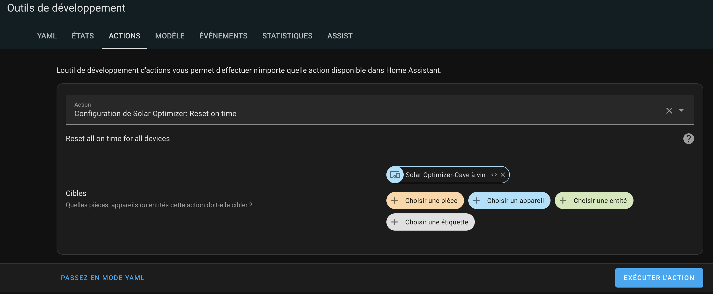

In YAML mode, it should look like this:

```yaml
action: solar_optimizer.reset_on_time
target:
  device_id: 825afe5fcee088d82d024f5f925cdb3e
data: {}
```

# Creating Sensor Templates for Your Installation

## start_device

This action forces the activation of a managed device for a given duration (or indefinitely if no duration is specified).

Behavior:
- The device's `enable` entity is set to `false` (SO no longer controls the device).
- The device is physically turned on.
- The status badge switches to **MANUAL**.
- A timer is started and persisted: if HA restarts, the timer resumes with the remaining duration.
- When the timer expires, the device is turned off and SO regains control (`enable = true`).

| Parameter   | Required | Description                                                                     |
| ----------- | -------- | ------------------------------------------------------------------------------- |
| `device_id` | Yes      | The unique ID of the managed device (the part after `switch.solar_optimizer_`)  |
| `duration`  | No       | Duration of the activation in hours (1, 4, 12 or 24). If omitted: no time limit |

In YAML mode:
```yaml
action: solar_optimizer.start_device
data:
  device_id: washing_machine
  duration: 4
```

## stop_device

This action stops the forced activation of a managed device. It cancels the running timer and turns the device off.

> **Note**: `stop_device` is not symmetric with `start_device` regarding the Enable button: stopping the device does not set `enable` back to `true`. This is intentional — the user must manually re-enable SO if needed.

| Parameter   | Required | Description                                                                    |
| ----------- | -------- | ------------------------------------------------------------------------------ |
| `device_id` | Yes      | The unique ID of the managed device (the part after `switch.solar_optimizer_`) |

In YAML mode:
```yaml
action: solar_optimizer.stop_device
data:
  device_id: washing_machine
```


# Creating Sensor Templates for Your Installation

Your setup may require the creation of specific sensors that need to be configured [here](README-en.md#configure-the-integration-for-the-first-time). The rules for these sensors are crucial and must be strictly followed to ensure the proper functioning of Solar Optimizer.

Below are my sensor templates (applicable only for an Enphase installation):

### File `configuration.yaml`:
```
template: !include templates.yaml
```

### File `templates.yaml`:
```
- sensor:
    - name: "Total power instanteneous production (W)"
      icon: mdi:solar-power-variant
      unique_id: total_power_produite_w
      device_class: power
      unit_of_measurement: "W"
      state_class: measurement
      state: >
        
        {{ power | round(2) }}
      availability: "{{ is_number(states('sensor.envoy_xxxxx_current_power_production')) }}"
    - name: "Total power consumption net instantaneous (W)"
      unique_id: total_power_consommee_net_w
      unit_of_measurement: "W"
      device_class: power
      state_class: measurement
      state: >
        
        {{ power_net }}
      availability: "{{ is_number(states('sensor.envoy_xxxxx_current_net_power_consumption')) }}"
```

Adapt these to fit your specific setup.

# Official Lovelace Card
The integration bundles an official native card (`custom:solar-optimizer-card`) to centrally control and monitor all devices managed by the `Solar Optimizer` scheduler. The card is self-configuring: it automatically scans all `solar_optimizer_*` entities — no additional YAML parameters required.

The card automatically adapts to your Home Assistant theme.

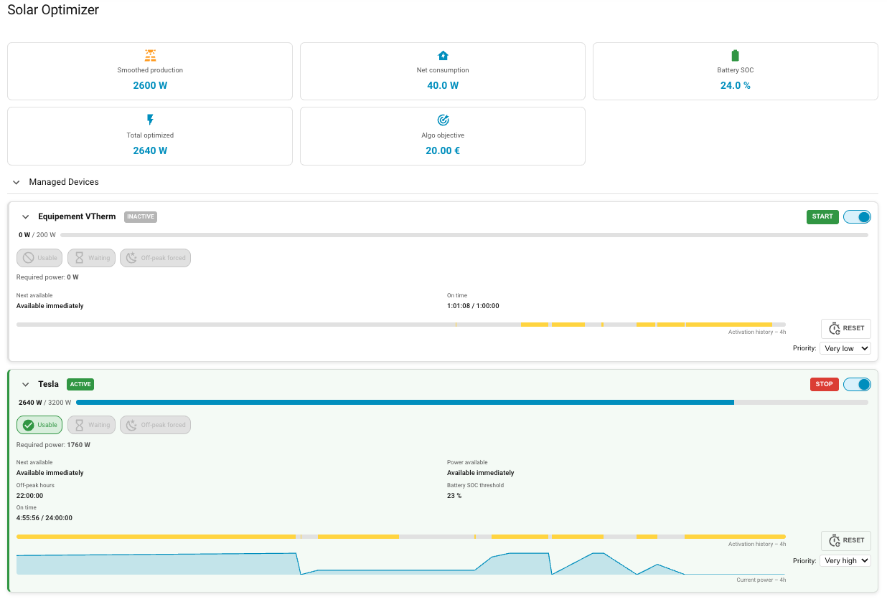

## Global Information

A **Solar Optimizer** header block displays real-time:
- Smoothed solar production,
- Net consumed power,
- Battery SOC (if configured),
- Total power allocated by the algorithm,
- Current algorithm objective score.

## Per-Device Information

Each managed device is displayed in a **collapsible/expandable** block. A global chevron allows you to expand or collapse all blocks at once.

When **collapsed**, only essential information is shown: name, status, current power, and action buttons.

When **expanded**, the following details appear:
- Next availability (date/time or "Available immediately"),
- Next availability for a power change,
- Usability indicator (whether the algorithm can use the device),
- Waiting indicator,
- Off-peak forced indicator,
- Off-peak hours time,
- Required power and current power,
- Daily on-time / maximum on-time,
- Battery SOC threshold (if configured).

## Device Status

Each device block shows a status badge and a colored left border. The two signals are independent:

| Left border | Meaning                                     |
| ----------- | ------------------------------------------- |
| 🟢 Green     | Device is **physically ON**                 |
| 🟠 Orange    | Device is **waiting** for next availability |
| ⬜ Grey      | Device is **physically OFF**                |

| Badge        | Color  | Meaning                                                                      |
| ------------ | ------ | ---------------------------------------------------------------------------- |
| **ACTIVE**   | Green  | Managed by SO and physically on                                              |
| **MANUAL**   | Amber  | Physically on but **SO management disabled** — user has taken manual control |
| **WAITING**  | Orange | Managed by SO, waiting for next available slot                               |
| **INACTIVE** | Grey   | Managed by SO and physically off                                             |
| **DISABLED** | Grey   | SO management disabled and device is off                                     |

The `MANUAL` status is the key signal: it means the device is consuming power but Solar Optimizer is not in control. The green border confirms the physical state regardless of the SO control state.

## Secondary Info

You can display custom per-device information (e.g. washing machine program, EV charger status) using the `secondary_info` option. The value supports simple templates with `states()` and `state_attr()`.

```yaml
type: custom:solar-optimizer-card
secondary_info:
  washing_machine: "Washing machine status: {{ states('sensor.washing_machine_program') }}"
  ev_charger: "{{ state_attr('sensor.ev_charger', 'status') }}"
```

The key is the device ID (the part after `switch.solar_optimizer_`). The rendered value appears above the Usable / Waiting / Off-peak indicators when the block is expanded.

## Activation History Bar

Each device has a **horizontal activation history bar**, always visible even when the block is collapsed. It mimics the native Home Assistant `binary_sensor` history bars:
- Colored segments correspond to activation periods (state `on`).
- Grey segments correspond to inactivity periods (state `off`).
- The bar covers the last **N hours** (24h by default, configurable).

The history window duration is configurable via the `history_hours` parameter:

| Parameter       | Type     | Default | Description                                       |
| --------------- | -------- | ------- | ------------------------------------------------- |
| `history_hours` | `number` | `24`    | Duration in hours of the displayed history window |

Example:
```yaml
type: custom:solar-optimizer-card
history_hours: 48
```

## Available Actions

Each device block exposes the following buttons and controls:
1. **Enable/Disable**: enables or disables algorithm management for the device,
2. **Duration selector**: a dropdown to choose a forced activation duration before pressing **START** (1h, 4h, 12h, 24h). When a forced activation is running, the selector is replaced by a badge showing the **remaining time** (in hours, or in minutes if less than 1h),
3. **Start/Stop**: starts or stops the device manually. If a duration is selected at the time of START, the `start_device` service is called and a timer is launched. STOP cancels the running timer.

A **priority selector** allows dynamically changing the device priority from the dashboard.

## How to Use the Official Card

Simply add a card of type `custom:solar-optimizer-card` into your Lovelace dashboard configuration:

```yaml
type: custom:solar-optimizer-card
```

All blocks are **collapsed by default** on first load. The open/close state of each block is automatically saved in the browser's `localStorage` and restored on the next visit.

The card is also fully registered in Home Assistant's card editor list under the name **Solar Optimizer Card**.

# Contributions are welcome!

If you would like to contribute, please read the [contribution guidelines](CONTRIBUTING.md)

***

[solar_optimizer]: https://github.com/jmcollin78/solar_optimizer
[buymecoffee]: https://www.buymeacoffee.com/jmcollin78
[buymecoffeebadge]: https://img.shields.io/badge/Buy%20me%20a%20beer-%245-orange?style=for-the-badge&logo=buy-me-a-beer
[commits-shield]: https://img.shields.io/github/commit-activity/y/jmcollin78/solar_optimizer.svg?style=for-the-badge
[commits]: https://github.com/jmcollin78/solar_optimizer/commits/master
[hacs]: https://github.com/custom-components/hacs
[hacs_badge]: https://img.shields.io/badge/HACS-Custom-41BDF5.svg?style=for-the-badge
[forum-shield]: https://img.shields.io/badge/community-forum-brightgreen.svg?style=for-the-badge
[forum]: https://forum.hacf.fr/
[license-shield]: https://img.shields.io/github/license/jmcollin78/solar_optimizer.svg?style=for-the-badge
[maintenance-shield]: https://img.shields.io/badge/maintainer-Joakim%20Sørensen%20%40ludeeus-blue.svg?style=for-the-badge
[releases-shield]: https://img.shields.io/github/release/jmcollin78/solar_optimizer.svg?style=for-the-badge
[releases]: https://github.com/jmcollin78/solar_optimizer/releases
